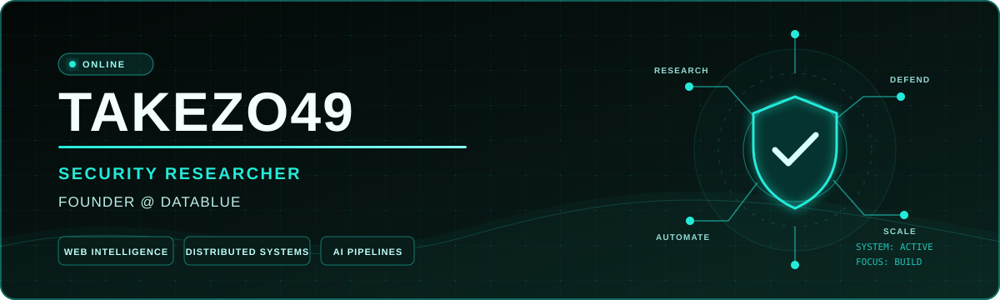

  

  
  
  

## `> whoami`

Security researcher, AI engineer, and full-stack systems builder. I work across application security, LLM agents, deep research, distributed backends, developer tooling, and production product engineering. I am also the founder of **[DataBlue](https://datablue.dev)**.

## `> tech stack`

  

## `> github signal`

  

  

## `> featured systems`

| Project | Focus |
|:--|:--|
| **[DataBlue](https://datablue.dev)** | Web intelligence, search infrastructure, browser orchestration, and LLM-ready data APIs. |
| **[dev-sync](https://github.com/Takezo49/dev-sync)** | TypeScript tooling for a cleaner development workflow. |
| **[PocketDev](https://github.com/Takezo49/PocketDev)** | A portable developer experience built with Dart. |
| **[i3-setup](https://github.com/Takezo49/i3-setup)** | A focused Linux and i3 development environment. |

  
  

